# **Hangman Game...**

### _Done by:  The Bug Hunting Pythons._  :bug:🦗:bug:

<p align="center"> 
  
</p>


* **Team members:**  Jana Rubiano Hurtado, Samuel Villamizar & Ana Maria De Felipe Briñez.

---

Welcome to this repository where we will showcase the development of the Hangman game using Python programming code.

Firstly, we will provide an index of the contents you can find in this repository:

 _**Index:**_

1. Explanation of the Hangman game code development.
   
      * Pseudocode outlining the basic code structure.
      * Detailed explanation of each function.
  
2. Instructions for installing the game.
3. Guide on how to use the code.
4. References.


We hope you find this repository informative and enjoy exploring the Hangman game development process.

---

##  _Explanation of the development of the hangman game code._  :woman_technologist::woman_technologist::man_technologist:

In the first place, the basic structure of the code was planned by means of a pseudocode. 

 `Pseudocode of the basic code structure. `

```mermaid
flowchart TD
    A[Start.] -->B(Print: Welcome to the hangman game.) 
    -->y(Ask the user if he/she is going to play alone or in pairs)
    y -->e(Yes) --> ex(Enable 2 player mode) --> E
    y --> r(No)
    
    --> E("Ask the user (or users) to choose a level.
    ")
    E --> F(Level: Easy.) --> I(" • 11 attempts
    • 8-12 letters in the word.
    ") -->L
    E --> G(Level: Intermediate.) --> J(" •  10 attempts
    • 5-8 letters in the word.
    ") -->L
    E --> H(Level: Hard.) --> K(" •  5 attempts
    •  5 > letters in the word.
    ") 
    --> L(" • Generate a random word that corresponds to the game difficulty.
     •  Print a hangman design corresponding to the game difficulty.
     •  Print underscores representing the length of the random word.
    ") 
    --> W("Ask the user to enter a letter.
    (If the game is in pairs mode, the users will be taking turns.)
    ")
    --> R{Does the entered letter belong to the generated word?}
    R -->n(No) --> q("• Add letter to the list of failed letters.
    • Print part of the hangman design.
    • Print failed letters.
    • Indicate a lost attempt.
    ") -->u{"Have the user (or users) lost all their attempts?
    "}
    u -->o(Yes) -->S("Game over. 
    Show the correct word. 
    ") --> P
    u--> t(No) --> W
    
    R -->Y(Yes) --> T("
    • Print the updated underscores with the new letter.
    • Compare the list with the string of the generated word.
    • (If the game is in pairs mode, a point will be added to the scoreboard)
    ") -->U{Is the word completed?} 
    U -->O(Yes) --> k("Print: You won
    (If the game is in pairs mode, the scores will be displayed)
    ")
    --> P(Ask the user or users if they want to play again)
    P --> b(No) --> w[End]
    P--> a(Yes) -->y
    U --> i(No) -->W
   
```


---

Secondly, we will explain the operation of each function of the code.

`The "clr()" function clears the screen using the os method ".system()".`

```python
import os
def clr():
    return os.system('cls')
```
Although the expression for clearing the screen is fairly short, it is used several times in the code, for that reason we defined an even shorter expression. 


`The "level()" function allows the user to choose a level and bassed on the choice, selects a word.`

```python
from  wonderwords import RandomWord
def level() -> str:
    r = RandomWord()

    choice = None
    while choice not in [1, 2, 3]:
        choice = int(input("1, 2 or 3"))
        clr()
    match choice:
        case 1:
            info = [r.word(word_min_length=8, word_max_length=19), 1]
        case 2:
            info = [r.word(word_min_length=5, word_max_length=8), 2]
        case 3:
            info = [r.word(word_max_length=5), 3]

    return info
```
In order to establish the difficulty level we tried different combinations of wordlenghts and number of tries. We end up with the easy level being a long word (case 1) with 11 tries and the hard level (case 3), a word of less than 5 letters and only 5 attempts. In the above code, case 1 is a word that has between 8 and 19 letters. The number of tries is defined by how many pictures the hangman drawing has. 
For generating the words we used a library called [**wonderwords**](http://https://pypi.org/project/wonderwords/ "**wonderwords**"). From that library we imported the **RandomWord** class and when generating a word we call the **word** method.

`We also wrote a function "color()" for coloring the three different hangman motives.`

```python
def color(num:int, picture:str):
    choice = num
    match choice:
        case 1:
            c = "\033[96m{}\033[0m".format(picture)
            return c
        case 2:
            c = "\033[93m{}\033[0m".format(picture)
            return c
        case 3:
            c = "\033[35m{}\033[0m".format(picture)
            return c
```
For assigning a color to the text in the python console we used the [ANSI](https://en.wikipedia.org/wiki/ANSI_escape_code#cite_note-CruzGianone1997-31:// "ANSI") escape codes.


To enable the functionality of the game code, three main libraries were imported.

1. **Time:** This library is used to manage a timer in the code. It allows for the creation of a countdown that controls the user's playing time.
2. **RandomWord:** This library can be installed using the command prompt (cmd) and enables the generation of random words with varying lengths and categories.
3. **Os:** This library allows access to the operating system, enabling interaction with various system functionalities.

 `libraries`
 
```Python
from  wonderwords import RandomWord
import time
import os
```

Once the libraries were imported, the different functions that allowed the correct operation of the code were developed.

(...)


---
##  _Steps to install the game._ :open_file_folder:

Get ready for game time! In order to play, you'll need to download the code. 

Wondering how? Don't worry, we'll guide you through the process below. :memo:

1. To begin, please ensure that Python is installed on your device.

If you are unsure about the installation process, you can follow the [link](https://www.python.org/downloads/) to install Python on your device.

2. After successfully installing Python, you will need to download the files attached in this repository.

<p align="center"> 
  
</p>

To download the files, simply right-click on the file name, select **"Save link as..."**, and save it to a location that is convenient for you. We recommend saving all the downloaded files from this repository in the same folder for organizational purposes.

**Recommendation:** When downloading the files, ensure that they are saved in the same format as the uploaded versions. If not, when prompted for **"filename,"** modify the file extension to the correct one, and for **"type,"** select "all files (.)"

<p align="center"> 
  
</p>

---
##  _How to use the code._ :tada:

---
##  _References._ :mag_right:

* Python. (2023). Download the latest python version for Windows. https://www.python.org/downloads/ 
