# **The Hangman Game.**

### _By:  The Bug Hunting Pythons._  :bug:🦗:bug:

<p align="center"> 
  
</p>


* **Team members:**  Jana Rubiano Hurtado & Ana Maria De Felipe Briñez.

---

Welcome to this repository where we will showcase the development of the Hangman game using Python programming code.

## _**Index:**_

1. Explanation of the Hangman game code development.
   
      * Pseudocode: outlining the basic code structure.
      * Detailed explanation of each function.
      * Libraries.
      * Files.
  
2. Instructions for installing the game.
4. References.


We hope you find this repository informative and enjoy exploring the Hangman game development process.

---

#  _Explanation of the development of the hangman game code._  :woman_technologist::woman_technologist:

In the first place, the basic structure of the code was planned by means of a pseudocode. 

 `Pseudocode of the basic code structure. `

```mermaid
flowchart TD
    A[Start.] 
    -->B(Print: Welcome to the hangman game.) 
    -->y(Ask the user if he/she is going to play alone or in pairs)
    y -->e(Yes) --> ex(Enable 2 player mode) --> E
    y --> r(No)
    
    --> E("Ask the user (or users) to choose a level.
    ")
    E --> F(Level: Easy.) --> I(" • 11 attempts
    • 8-12 letters in the word.
    ") -->L
    E --> G(Level: Intermediate.) --> J(" •  10 attempts
    • 5-8 letters in the word.
    ") -->L
    E --> H(Level: Hard.) --> K(" •  5 attempts
    •  5 > letters in the word.
    ") 
    --> L(" • Generate a random word that corresponds to the game difficulty.
     •  Print a hangman design corresponding to the game difficulty.
     •  Print underscores representing the length of the random word.
    ") 
    --> we(Initialize countdown)
    --> W("Ask the user to enter a letter.
    (If the game is in pairs mode, the users will be taking turns.)
    ")
    --> re{Time = 0}
    re--> ji(Yes) 
    ji -->sa(You ran out of time) -->S
    re -->ju(No)
    --> R{Entered letter belong to the generated word}
    R -->n(No) --> q("• Add letter to the list of failed letters.
    • Print part of the hangman design.
    • Print failed letters.
    • Indicate a lost attempt.
    ") -->u{User still has attempts}
    u -->o(No) -->jq(Stop countdown)
    -->S("Game over. 
    Show the correct word. 
    ") --> P
    u--> t(Yes) --> W
    
    R -->Y(Yes) --> T("
    • Print the updated underscores with the new letter.
    • Compare the list with the string of the generated word.
    • (If the game is in pairs mode, a point will be added to the scoreboard)
    ") -->U{Word is completed and time != 0} 
    U -->O(Yes) -->wr(Stop countdown)
    --> k("Print: You won
    (If the game is in pairs mode, the scores will be displayed)
    ")
    --> P(Ask the user or users if they want to play again)
    P --> b(No) --> w[End]
    P--> a(Yes) -->y
    U --> i(No) -->W
```


---

## • Explanation of each function.

Here we explain the operation of the helper functions that make the main code work.

`The "clr()" function clears the screen using the os method ".system()".`

```python
import os
def clr():
    return os.system('cls')
```
Although the expression for clearing the screen is fairly short, it is used several times in the code, for that reason we defined an even shorter expression. 


`The "level()" function allows the user to choose a level and bassed on the choice, selects a word.`

```python
from  wonderwords import RandomWord
def level() -> str:
    r = RandomWord()

    choice = None
    while choice not in [1, 2, 3]:
        choice = int(input("1, 2 or 3"))
        clr()
    match choice:
        case 1:
            info = [r.word(word_min_length=8, word_max_length=19), 1, 91]
        case 2:
            info = [r.word(word_min_length=5, word_max_length=8), 2, 61]
        case 3:
            info = [r.word(word_max_length=5), 3, 41]

    return info
```
In order to establish the difficulty level we tried different combinations of wordlenghts, number of tries and time. We end up with the easy level being a long word (case 1) with 11 tries and the hard level (case 3), a word of less than 6 letters and only 5 attempts. In the above code, case 1 is a word that has between 8 and 14 letters, 11 tries and 91 seconds. The number of tries is defined by how many pictures the hangman drawing has. 
For generating the words we used a library called [**wonderwords**](https://pypi.org/project/wonderwords/). From that library we imported the **RandomWord** class and when generating a word we call the **word** method.

`We also wrote a function "color()" for coloring the three different hangman motives.`

```python
def color(num:int, picture:str):
    match num:
        case 1:
            return "\033[96m{}\033[0m".format(picture)
        case 2:
            return "\033[93m{}\033[0m".format(picture)
        case 3:
            return "\033[35m{}\033[0m".format(picture)
```
For assigning a color to the text in the python console we used the [ANSI](https://en.wikipedia.org/wiki/ANSI_escape_code#cite_note-CruzGianone1997-31:// "ANSI") escape codes.

This function prints text that is frequently used in the game.
```python
textDisplay(num, word, players)
```

This game includes the **countdown(tm)** function and it allows the program to keep track of time. The argument it receives are seconds, which vary depending on the difficulty level.
```python
for sec in range(tm): # loop n times based on the argument
  timer -= 1 # countdown
  time.sleep(1)
  print("\t\t\t{}:{}".format(timer//60, timer%60) if timer%60...
```
In order to run both functions in the console at the same time this code uses threading. 
```python
import threading
def countdown(tm): 
    while True:
        global stop_threads # declare global stop flag
        global timer # declare global var for time in seconds
        timer = tm...
```
It is important to note that, because of threading this function is in the same file as the main function.
## • Libraries.

To enable the functionality of the game code, five libraries were imported.

1. **Time:** This library is used to make a delay when the user enters a repeated letter, it prints a message and resumes the game.
   
   ```Python
    elif char in failed_letts: # when letter was already inputted
            print("Try a new letter!")
            time.sleep(2)
   ```
   It is also used for the countdown.
   ```Python
   for sec in range(tm): # loop n times based on the argument
     timer -= 1 # countdown
     time.sleep(1)
   ```
3. **wonderwords:** This library, which  generates random words with varying lengths and categories, can be installed using the command prompt (cmd).
  ```bash
    pip install wonderwords
  ```
  or downloading the requirements file and running the following command in a virtual environment: 
  
  ```bash
    py -m pip install -r requirements.txt
  ```
  
3. **Os:** This library allows access to the operating system, enabling interaction with various system functionalities.
  
4. **json:** This is used for opening the drawings, which are stored in a json file.
   
5. **threading:** The threading library allows to have control over multiple threads **_(one thread = a single sequential flow of control within a program)_** running and performing different tasks at the same time in the same program.

## • Files 

In this section we will explain the content and function of each file.

* In the **_hangman.py_** file is the main program and the countdown function, and is the file you run when playing the game.
  
* In the **_hangmanFunctions.py_** you will find the helper functions, which are imported to the hangman file.

* There are two options for the drawings. You can either download the **_'drawings.json'_** file or use the **_'text_to_json.py'_** script. The first file contains the drawings in an unreadable format but allows you to play the game immediately. The second option provides the drawings in their original design, but you need to run the 'text_to_json.py' script before executing 'hangman.py'. By running 'text_to_json.py', you will create the 'drawings.json' file, and everything will be ready to start playing.

<p align="center"> 
  
  
  
</p>
  
* In **_requirements.txt_** you will find the libraries that you need to install in order to run the code, in this case the only library is wonderwords. 

---
#  _Steps to install the game._ :open_file_folder:

Get ready for game time! In order to play, you'll need to download the code. 

Wondering how? Don't worry, we'll guide you through the process below. :memo:

1. To begin, please ensure that Python is installed on your device.

If you are unsure about the installation process, you can follow the [link](https://www.python.org/downloads/) to install Python on your device.

2. After successfully installing Python, you will need to download the files attached in this repository.

<p align="center"> 
  
</p>

To download the files, please follow these steps:

* Navigate to the upper right corner of the page.
* Click on the "code" button.
* Then, select the option "download ZIP" to initiate the download process.

<p align="center"> 
  
</p>

Once the folder is downloaded, you need to unzip it.

3. After successfully downloading the required files, you have two options to proceed: open them in your code editor or directly access them in the Windows terminal using the "Windows + r" command.


To ensure the code runs smoothly and to prevent any potential issues arising from variations in Python versions and installed packages on your device, we recommend following the steps outlined below:


1.	Create a virtual environment in the folder where you downloaded the files. If you're unsure how to create the environment, you can follow [link](https://packaging.python.org/en/latest/guides/installing-using-pip-and-virtual-environments/) as guide.
   
2.	Activate the virtual environment. On some Windows devices, you may need to use the following command to proceed with the creation of the virtual environment.

  ```bash
    Set-ExecutionPolicy Unrestricted -Scope Process
  ```

3.	Install the "wonderwords" library as instructed in the "libraries" section and once the installation is complete, you can start playing the game. 

4. Finally, the code will start running, and you can interact with the game by entering characters as prompted.

**Enjoy playing!** :tada:

---
#  _References._ :mag_right:

* Brownlee, J. (2022). _Python Threading: The Complete Guide_. https://superfastpython.com/threading-in-python/ 
* Manthanchauhan. (2021). _Python | Different ways to kill a Thread_. https://www.geeksforgeeks.org/python-different-ways-to-kill-a-thread/ 
* Python. (2023). _Download the latest python version for Windows._ https://www.python.org/downloads/
* Python. (2023). _wonderwords 2.2.0._ https://pypi.org/project/wonderwords/
* Python. (2023). _Threading — Thread-based parallelism_. https://docs.python.org/3/library/threading.html
* Python. (2023). _virtualenv_. https://packaging.python.org/en/latest/guides/installing-using-pip-and-virtual-environments
* Wikipedia. (2023). _ANSI escape code._ https://en.wikipedia.org/wiki/ANSI_escape_code#cite_note-CruzGianone1997-31://

