# **Hangman Game...**

### _Done by:  The Bug Hunting Pythons._  :bug:🦗:bug:

  

* **Team members:**  Jana Rubiano Hurtado, Samuel Villamizar & Ana Maria De Felipe Briñez.

---

Welcome to this repository in which we would like to show you the development of the hangman game through Python programming code.

First of all, we will present the index of what you can find in this repository.

**Index:**
* Explanation of the development of the hangman game code.
* Steps to install the game.
* How to use the code.
* References. 

---

##  _Explanation of the development of the hangman game code._  :woman_technologist::woman_technologist::man_technologist:

In the first place, the basic structure of the code was planned by means of a pseudocode. 

 `Pseudocode of the basic code structure. `

```mermaid

flowchart TD

    A[Begin.] -->B(Print: Welcome to the hangman game.) -->C(Show game levels.)
    --> D("Level 1: Easy.
    Level 2: Intermediate.
    Level 3: Hard.")
    --> E(Allow the user to choose a level.)
    E --> F(Level: Easy.) --> I(" • X attempts
    • 2 ↔ 5 letters in the word.
    ") -->L
    E --> G(Level: Intermediate.) --> J(" •  X attempts
    • 6 ↔ 8 letters in the word.
    ") -->L
    E --> H(Level: Hard.) --> K(" •  X attempts
   •  9 ↔ 19 letters in the word.
    ") 
    --> L(Generate a random word using a python library related to game difficulty) 
    --> N(Print hangman design related to game difficulty)
    --> Q(Print underscores with the random word length)
    --> W(Allow the user to enter a letter.)
    --> R{Does the entered letter belong to the generated word?}
    R -->n(No) --> q("• Add word to list. 
    • Print part of the hangman design.
    • Print failed letters. 
    • Lost attempt
    ") -->u{Has the user lost all its attempts?}
    u -->o(Yes) -->S("Game over. 
    Show the correct word. 
    ") --> P
    u--> t(No) --> W
    

    R -->Y(Yes) --> T(" • Add word to list. 
    • Print back underscores with the letter.
    • Compare list with the string of the generated word
    ") -->U{Is the word completed?} 
    U -->O(Yes) --> P(Ask the user if he/she wants to play again)
    P --> b(No) --> w[End]
    P--> a(Yes) -->C
    U --> i(No) -->W
   

```

