# **Hangman Game...**

### _Done by:  The Bug Hunting Pythons._  :bug:🦗:bug:

<p align="center">
  
</p>

* **Team members:**  Jana Rubiano Hurtado, Samuel Villamizar & Ana Maria De Felipe Briñez.

---

Welcome to this repository in which we would like to show you the development of the hangman game through Python programming code.

First of all, we will present the index of what you can find in this repository.

**Index:**
* Explanation of the development of the hangman game code.
   * Pseudocode of the basic code structure.
   * Each function explanation. 
* Steps to install the game.
* How to use the code.
* References. 

---

##  _Explanation of the development of the hangman game code._  :woman_technologist::woman_technologist::man_technologist:

In the first place, the basic structure of the code was planned by means of a pseudocode. 

 `Pseudocode of the basic code structure. `

```mermaid
flowchart TD
    A[Start.] -->B(Print: Welcome to the hangman game.) -->C(Show game levels.)
    --> D("Level 1: Easy.
    Level 2: Intermediate.
    Level 3: Hard.")
    --> E(Allow the user to choose a level.)
    E --> F(Level: Easy.) --> I(" • X attempts
    • 2 ↔ 5 letters in the word.
    ") -->L
    E --> G(Level: Intermediate.) --> J(" •  X attempts
    • 6 ↔ 8 letters in the word.
    ") -->L
    E --> H(Level: Hard.) --> K(" •  X attempts
    •  9 ↔ 19 letters in the word.
    ") 
    --> L(" • Generate a random word that corresponds to the game difficulty.
     •  Print a hangman design corresponding to the game difficulty.
     •  Print underscores representing the length of the random word.
    ") 
    --> W(Allow the user to enter a letter.)
    --> R{Does the entered letter belong to the generated word?}
    R -->n(No) --> q("• Add the word to the list.
    • Print part of the hangman design.
    • Print the failed letters.
    • Indicate a lost attempt.
    ") -->u{Has the user lost all its attempts?}
    u -->o(Yes) -->S("Game over. 
    Show the correct word. 
    ") --> P
    u--> t(No) --> W
    
    R -->Y(Yes) --> T(" • Add the word to the list.
    • Print the updated underscores with the letter.
    • Compare the list with the string of the generated word.
    ") -->U{Is the word completed?} 
    U -->O(Yes) --> k(Print: Congratulations)
    --> P(Ask the user if he/she wants to play again)
    P --> b(No) --> w[End]
    P--> a(Yes) -->C
    U --> i(No) -->W
   
```


---
Secondly, we will explain the operation of each function of the code.

The** clr()** function clears the screen using the os method **.system()**.

```python
import os
def clr():
    return os.system('cls')
```
Although the expression for clearing the screen is fairly short, it is used several times in the code, for that reason we defined an even shorter expression. 


The** level()** function allows the user to choose a level and bassed on the choice, selects a word.

```python
from  wonderwords import RandomWord
def level() -> str:
    r = RandomWord()

    choice = None
    while choice not in [1, 2, 3]:
        choice = int(input("1, 2 or 3"))
        clr()
    match choice:
        case 1:
            info = [r.word(word_min_length=8, word_max_length=19), 1]
        case 2:
            info = [r.word(word_min_length=5, word_max_length=8), 2]
        case 3:
            info = [r.word(word_max_length=5), 3]

    return info
```
In order to establish the difficulty level we tried different combinations of wordlenghts and number of tries. We end up with the easy level being a long word (case 1) with 11 tries. In the above code, case 1 is a word that has between 8 and 19 letters. The number of tries is defined by how many pictures the hangman drawing has. 
For generating the words we used a library called [**wonderwords**](http://https://pypi.org/project/wonderwords/ "**wonderwords**"). From that library we imported the **RandomWord** class and when generating a word we call the **word** method.

We also wrote a function **color()** for coloring the three different hangman motives. 
```python
def color(num:int, picture:str):
    choice = num
    match choice:
        case 1:
            c = "\033[96m{}\033[0m".format(picture)
            return c
        case 2:
            c = "\033[93m{}\033[0m".format(picture)
            return c
        case 3:
            c = "\033[35m{}\033[0m".format(picture)
            return c
```
For assigning a color to the text in the python console, we used the [ANSI escape codes](htthttps://en.wikipedia.org/wiki/ANSI_escape_code#cite_note-CruzGianone1997-31p:// "ANSI escpare codes").

To enable the functionality of the game code, three main libraries were imported.

1. **Time:** This library is used to manage a timer in the code. It allows for the creation of a countdown that controls the user's playing time.
2. **RandomWord:** This library can be installed using the command prompt (cmd) and enables the generation of random words with varying lengths and categories.
3. **Os:** This library allows access to the operating system, enabling interaction with various system functionalities.

 `libraries`
 
```Python
from  wonderwords import RandomWord
import time
import os
```

Once the libraries were imported, the different functions that allowed the correct operation of the code were developed.

 `Function to clear the console screen.`
 
 
```Python
def clr():
    return os.system('cls')
```


---
##  _Steps to install the game._ :open_file_folder::memo:

---
##  _How to use the code._ :tada:

---
##  _References._ :mag_right:
